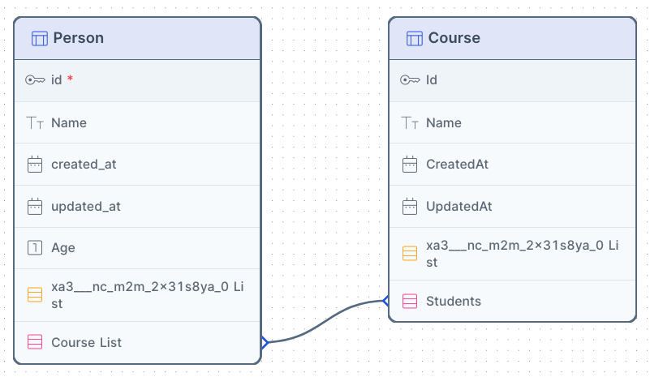

# My default Web technology Stack

This template provides the my default structure for **small** web projects. The components:

- [FastAPI](https://fastapi.tiangolo.com/) as the web framework
- The [NocoDB]() API for data storage using [python-nocodb](https://github.com/ElChicoDePython/python-nocodb)
- [Dynaconf](https://www.dynaconf.com/) for the configuration management
- [Typer](https://typer.tiangolo.com/) for the CLI
- [Pydantic](https://docs.pydantic.dev) for data validation and (de-)serialization
- [Alpine.js](https://alpinejs.dev/) as the frontend Javascript framework
- [Bulma](https://bulma.io/) as the frontend CSS framework


## Setup after cloning

1. Modify the `pyproject.toml`
2. Modify the `settings.toml`
3. Adapt your models in `PACKAGE_NAME/models.py`
4. Document the NocoDB model in the Readme


## Installation

First create the `.secrets.toml` from `secrets.tpl.toml`.

```
cp secrets.tpl.toml .secrets.toml
```

Modify the `.secrets.toml` as needed. Then install the package.

```
pip3 install -e .
```

You can then run your the application.

```
project run
```


## The data model in NocoDB

We assume this data model in NocoDB:

